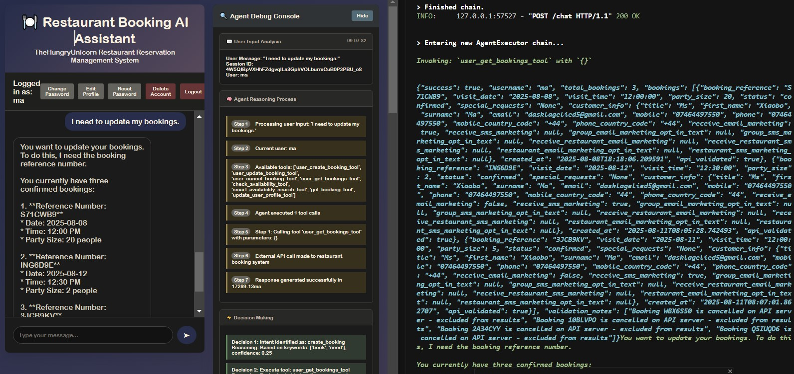
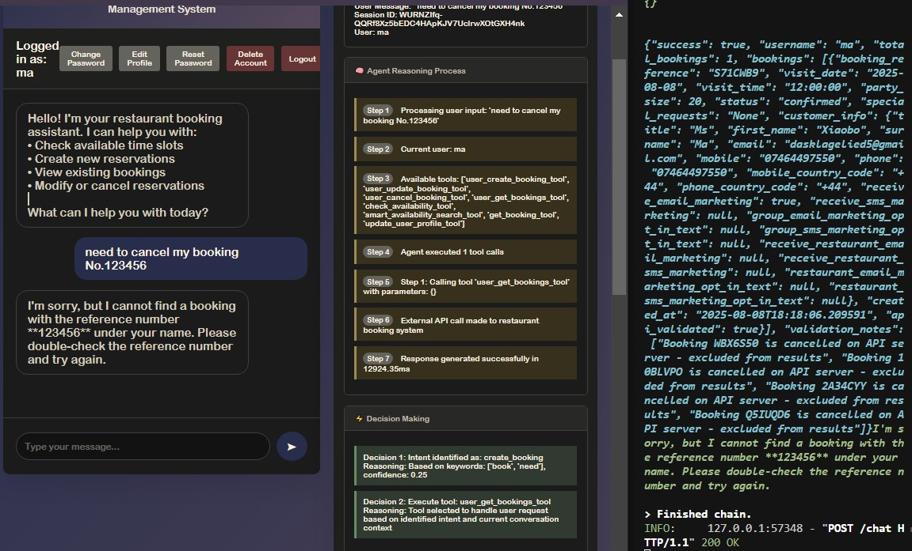
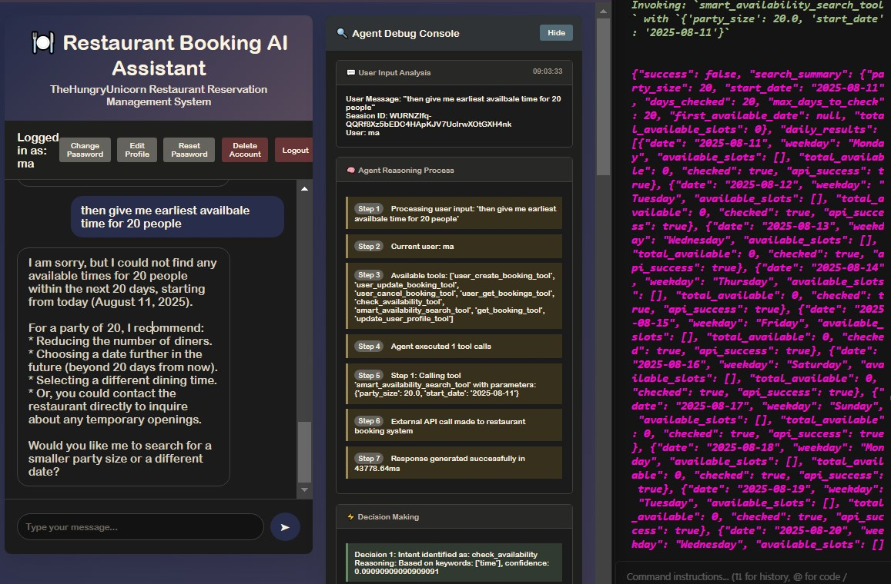

# Restaurant Booking AI Assistant

## 1. Overview

The system is a conversational agent implemented using the LangChain framework. The agent's state, including user profiles and conversation histories, is persisted to a SQLite database to support multiple users and continuity across sessions. It provides two primary interfaces: a feature-rich web UI with integrated developer diagnostics, and a command-line interface (CLI) for direct interaction.

**Core Features**

  **Full Reservation Lifecycle Management**: The agent exposes tools that map directly to the external API's capabilities, including creation, retrieval, updates, and cancellation of bookings.
  **Context-Aware Interaction**: The system is designed to be user-aware. It loads user-specific data (e.g., name, contact information, marketing preferences) at the start of a session and uses this context to auto-populate required information, avoiding repetitive questioning. This is implemented via the `user_aware_tools.py` wrapper module.
  **Persistent State**: All user data and chat histories are stored in a local SQLite database, managed by the SQLAlchemy ORM. This ensures that conversations can be paused and resumed without context loss.
  **Advanced Query Handling**: The `smart_availability_search_tool` is implemented to handle complex user queries like "find the earliest available table for twenty people next week." It does this by iterating through multiple days in a single tool execution, overcoming a common limitation in simple agent loops.
  **Developer Observability**: The web UI (`static/index.html`) includes a debug panel that provides real-time insight into the agent's internal state, including the LLM's reasoning chain, tool call sequences with full parameters, and raw API responses.

Demo Video: 
## 2. Getting Started Instructions

### 2.1. Prerequisites

  Python 3.8+
  A local, running instance of the mock restaurant booking API server (`AppellaAI/Restaurant-Booking-Mock-API-Server`).
  An API key from either OpenAI or Google AI.

### 2.2. Environment Setup

1.  **Clone the repository** and navigate into the project directory.
2.  **Create and activate a Python virtual environment** to isolate dependencies.
    ```bash
    python -m venv venv
    source venv/bin/activate  # On Windows, use `venv\Scripts\activate`
    ```
3.  **Install the required packages:**
    ```bash
    pip install -r requirements.txt
    ```
4.  **Configure environment variables.** Create a file named `.env` in the project root and populate it with your credentials. Use the following template:
    ```env
    # .env file

    # --- LLM Configuration ---
    # Your secret key from OpenAI or Google AI.
    OPENAI_API_KEY="sk-..."

    # The specific model to use. gpt-4-turbo is recommended for better reasoning.
    OPENAI_MODEL="gpt-4-turbo"

    # Optional: If using a proxy or a self-hosted model (e.g., Ollama), provide the base URL.
    # OPENAI_BASE_URL="http://localhost:11434/v1"

    # --- External API Server Configuration ---
    # The URL of the running mock booking server.
    RESTAURANT_API_BASE_URL="http://localhost:8547"

    # The static bearer token required by the mock API server.
    # This value is found in the mock server's documentation.
    RESTAURANT_API_TOKEN="your-static-bearer-token-from-mock-api"

    # The name of the restaurant target.
    RESTAURANT_NAME="TheHungryUnicorn"
    ```

### 2.3. Running the Application

First, ensure the dependent mock API server is running. Then, start the main application using one of the following modes.

  **Web Interface Mode (Recommended):**
    This mode starts a FastAPI server that provides API endpoints for the web UI.
    ```bash
    python main.py --mode api
    ```
    Access the application by navigating to `http://localhost:8000` in your browser.

  **Command-Line Interface Mode:**
    This mode launches an interactive CLI session.
    ```bash
    python main.py --mode cli
    ```

## 3. Design Rationale

### 3.1. Framework and Tool Selection

  **LangChain (Agent Framework)**
      **Reason for Choice**: LangChain was selected for its mature implementation of the "Tools" paradigm for LLM agents. Specifically, its `AgentExecutor` and `create_openai_tools_agent` function provide a robust loop for managing the agent's reasoning, tool selection, and execution cycle. This significantly accelerated development by providing a pre-built, battle-tested orchestration engine.
      **Trade-off**: The choice introduces a heavy dependency and a layer of abstraction that can sometimes obscure the underlying mechanics. Direct interaction with an LLM API would offer more control but would require manually implementing the entire ReAct (Reason-Act) loop, error handling, and tool dispatching logic.

  **SQLAlchemy (ORM)**
      **Reason for Choice**: SQLAlchemy was chosen as the Object-Relational Mapper to interact with the SQLite database. Its primary benefits are:
        1.  **SQL Injection Prevention**: Using the ORM's query builder (e.g., `db.query(User).filter(...)`), all inputs are automatically parameterized, which is the standard defense against SQL injection attacks. This is a critical security feature.
        2.  **Database Agnosticism**: The application code interacts with Python objects and methods, not raw SQL. This makes it straightforward to migrate the database from SQLite to a production system like PostgreSQL by simply changing the connection string.
      **Trade-off**: The ORM adds a layer of complexity and can sometimes generate less efficient queries than hand-written SQL. For this application's access patterns, the security and maintainability benefits far outweigh this potential performance cost.

  **Pydantic (Data Validation)**
      **Reason for Choice**: Pydantic is used to define strict data schemas in `src/api/schemas.py`. It serves a crucial dual role as a quality and security gatekeeper:
        1.  **Outgoing Request Validation**: Before sending a request to the external API, the data is validated against a Pydantic model. This prevents malformed requests from ever leaving the system.
        2.  **Incoming Response Validation**: The JSON response from the external API is immediately parsed by a Pydantic model. If the response structure or data types are unexpected, an error is raised, preventing corrupted or unsafe data from being processed by the application.
      **Trade-off**: There is a minor performance overhead associated with data validation on every API call, but this is a necessary cost for building a reliable system that interfaces with external services.

### 3.2. Design Decisions and Trade-offs

  **Component: Agent Orchestration (`src/agent/booking_agent.py`)**
      **Decision**: A single `BookingAgent` class encapsulates all agent-related logic. It is instantiated per-user for each session.
      **Rationale**: This design keeps the agent's configuration and state management logic contained. The agent's core prompt is dynamically generated within its constructor (`_get_enhanced_system_prompt`), allowing for the injection of user-specific data and real-time information (like the current date). This makes the agent highly context-aware from the moment it's created.
      **Trade-off**: As more agent types or complex configurations are needed, this single class could grow. A future iteration might use a factory pattern to construct different agent types based on configuration.

  **Component: Tooling Layer (`src/tools/`)**
      **Decision**: The system uses a "User-Aware Wrapper" pattern. Core business logic tools are in `booking_tools.py`, while `user_aware_tools.py` provides wrapped versions of these tools for the agent to use.
      **Rationale**: This separates two distinct concerns: the pure business logic of a tool (e.g., creating a booking given a full set of parameters) and the user-centric logic of enriching a tool call with context (e.g., fetching a user's saved email). This makes the core tools in `booking_tools.py` highly reusable and easier to unit test, as they are deterministic functions.
      **Trade-off**: This pattern adds an extra layer of indirection, which can slightly increase the complexity of tracing a tool call. However, the benefit of clean separation of concerns was deemed more valuable.

  **Component: Persistence Layer (`src/database/` & `src/storage/`)**
      **Decision**: A two-tiered persistence layer was implemented. `database/` contains low-level ORM models and CRUD functions, while `storage/manager.py` provides a cleaner, more abstract interface.
      **Rationale**: The rest of the application should not need to know about SQLAlchemy sessions or `db.commit()` calls. The `StorageManager` provides an interface like `storage.get_user(username)`, hiding the underlying implementation details. This adheres to the principle of information hiding and makes the application easier to reason about.
      **Trade-off**: The current persistence choice, SQLite, is the primary bottleneck for concurrent operations. While the two-tiered abstraction is good practice, it does not mitigate the underlying database's limitation regarding file-level locking, which prevents simultaneous writes. This was an acceptable trade-off for rapid initial development but is the first component that must be swapped for production use.



- **Component: State Management (`src/agent/booking_agent.py`, `src/storage/manager.py`)**
  - **Decision**: Maintain an in-process, per-session `BookingAgent` instance that caches the LangChain executor context in memory, while persisting the conversational state to SQLite after every turn.
  - **Rationale**:
      1. **Low latency across turns**: Reusing the executor, prompt, and tool wiring avoids per-turn re-initialization overhead and reduces token churn.
      2. **Durability and recovery**: Chat history is serialized and stored via `StorageManager.save_session(...)` at the end of each turn, enabling recovery after restarts.
      3. **Clear separation**: Business operations flow through tools; persistence concerns are isolated in the storage layer.
  - **Trade-off**: Requests in the same session must be routed to the same process, otherwise the in-memory `BookingAgent` is not reused. Within one session, requests should be serialized to preserve turn ordering and avoid race conditions on history updates. Meanwhile, memory grows with active sessions as each active session holds an agent context. These are currently accepted for prototype use.


### 3.3. Production Scalability Strategy

The roadmap proceeds in four stages to resolve these main constraints for the current prototype:

1.  **SQLite's Concurrency Limitation**: The database uses file-level locking, which serializes all write operations, making it the primary bottleneck for multi-user support.
2.  **In-Process State Management**: The `BookingAgent` object and its associated chat history are loaded into the memory of a single Python process, creating session affinity. This prevents simple load balancing and complicates failover.
3.  **Lack of Observability**: Without baseline metrics, any performance optimization is based on guesswork rather than data.

#### **Stage 0: Establish Baseline and Observability (Prerequisite)**

**Objective**: To quantify the current system's performance and establish a data-driven foundation for all subsequent optimization work.

  **Actions**:
    1.  **Define Service Level Objectives (SLOs)**: Establish clear, measurable success criteria. This includes targets for p50 and p95 conversational turn latency, sustained requests-per-second (RPS), and acceptable error rates under synthetic load.
    2.  **Instrument Application Metrics**: Integrate a metrics library (e.g., Prometheus client) to export key performance indicators. This must include latency for database queries, external API calls (`tool-call-latency`), and end-to-end turn processing time.
    3.  **Implement Structured Logging**: Add structured logs (JSON format) for key events in the session lifecycle (e.g., `session_start`, `tool_call_invoked`, `state_persisted`) to enable effective debugging and analysis.
    4.  **Create a Baseline Test Suite**: Implement a foundational set of `pytest`-based tests, including unit tests for critical tool functions and a simple end-to-end smoke test that simulates a user logging in, having a short conversation, and verifying that the state is correctly persisted.

  **Acceptance Criteria**:
      A reproducible performance baseline is established under a synthetic load generated by a tool like `locust` or `k6`.
      A monitoring dashboard (e.g., in Grafana) is created, visualizing the key latency and error rate metrics.


#### **Stage 1: Database Migration to PostgreSQL (Addressing the Concurrency Bottleneck)**

**Objective**: To eliminate the fundamental write-concurrency bottleneck imposed by SQLite, enabling robust multi-user support. SQLAlchemy ORM facilitates this migration.

  **Problem Statement**: SQLite's file-level locking mechanism serializes all write operations, making it fundamentally unsuitable for an environment with multiple concurrent users writing to the database (e.g., saving chat histories, creating bookings).

  **Actions: Migrate to PostgreSQL**:
    1. **Refactor to a DSN‑based initialization**: provide a unified DATABASE_URL via environment variables, remove filesystem assumptions, and construct the SQLAlchemy engine with proper pooling and health checks (for example, QueuePool with pool_pre_ping enabled). Use a production‑appropriate transaction isolation level (such as READ COMMITTED) and configure the session with expire_on_commit=False to avoid unnecessary object expiration and round‑trips under concurrency.
  	2. **Use Alembic for schema management**: This keeps evolution predictable and environments consistent. Meanwhile, standardize on DATABASE_URL in .env (supporting both PostgreSQL and a SQLite fallback for local/CI runs) without changing ORM models or business logic. With these adjustments in place, the service achieves stable connection reuse and observability under multi‑user, write‑heavy workloads while preserving the current code structure.

  **Acceptance Criteria**:
      The system can sustain a load test with a target number of concurrent write-heavy user sessions (e.g., 50 concurrent users) with an error rate for write timeouts below a defined threshold (e.g., <0.1%).
      The p95 turn latency under this load does not show a significant regression compared to the single-user baseline from Stage 0.

#### **Stage 2: Externalize Session State to Redis (Reducing I/O Latency)**

**Objective**: To reduce the latency of each conversational turn by moving active session state from the slower disk-based database to a high-speed in-memory store.

  **Problem Statement**: Although PostgreSQL solves the concurrency issue, every conversational turn still incurs the I/O latency of reading the entire chat history from disk and writing it back. This impacts tail latency and user experience.

  **Actions**:
    1.  **Introduce Redis**: Integrate Redis as the primary store for *active* session data.
    2.  **Define Redis Schema**:
          `session:history:<session_id>` (Redis List): Stores the sequence of conversational messages. Reads and writes for active turns happen here.
          `session:metadata:<session_id>` (Redis Hash): Stores session metadata like user ID, creation time, etc.
          `session:lock:<session_id>` (Redis Lock): A short-lived lock to prevent race conditions if concurrent requests for the same session were ever to occur (e.g., user double-clicking send).
    3.  **Implement a Hybrid State Management Strategy**:
          **On Session Start**: "Warm" the cache by loading the user's chat history from PostgreSQL into the corresponding Redis list.
          **During Session**: All conversational turns read from and append to the Redis list exclusively.
          **On Session End (or via Checkpoints)**: Implement a "write-behind" caching strategy. A background task (using Celery or a simple thread pool) periodically flushes the complete session history from Redis back to PostgreSQL for durable, long-term storage.

  **Acceptance Criteria**:
      A measurable and significant reduction (target: >30%) in p95 turn latency compared to the Stage 1 baseline, directly proving the effectiveness of the caching layer.
      Demonstrate zero data loss during failover tests (e.g., by killing the application process mid-conversation and verifying that the session can be fully recovered from the last checkpoint in PostgreSQL).


#### **Stage 3: Achieve True Statelessness (Enabling Horizontal Scaling)**

**Objective**: To decouple the agent's execution from any single server process, enabling true horizontal scalability and high availability.

  **Problem Statement**: With state now externalized, the final constraint is that the `BookingAgent` object itself might hold some state in memory, implicitly creating session affinity and binding a user's session to a single server instance.

  **Actions**:
    1.  **Refactor Agent Instantiation**: Modify the application logic to ensure the `BookingAgent` object is lightweight and reconstructed on every incoming request.
    2.  **On-Demand State Hydration**: The agent's constructor will be responsible for pulling all necessary context for a given turn directly from the shared state stores (Redis for active sessions, PostgreSQL for new sessions).
    3.  **Eliminate In-Process Caches**: Ensure no per-request state is cached within the application process itself. All state must be derived from the external Redis/PostgreSQL stores.

  **Acceptance Criteria**:
      The system passes a "shuffled routing" test: a load balancer is configured to route requests for the *same session* to different server replicas randomly. The conversation must proceed without any state loss or correctness issues, proving the absence of session affinity.


#### **Stage 4: Deploy for Scale and Resilience**

**Objective**: To deploy the now-stateless and performant application in a resilient, auto-scaling production environment.

  **Actions**:
    1.  **Containerize the Application**: Create a Dockerfile for the agent service.
    2.  **Deploy with an Orchestrator**: Use a container orchestrator like Kubernetes to deploy multiple replicas of the agent service behind a load balancer.
    3.  **Configure Autoscaling**: Set up Horizontal Pod Autoscalers (HPAs) based on CPU and memory usage to automatically scale the number of agent replicas based on traffic.
    4.  **Implement Resiliency Patterns**: Integrate a library like `tenacity` to add exponential backoff and retry logic for calls to the external booking API. Implement the Circuit Breaker pattern to prevent cascading failures if the external API becomes unresponsive.

  **Acceptance Criteria**:
      The system demonstrates near-linear scalability: doubling the number of replicas results in a near-doubling of the sustained RPS the system can handle within its SLOs.
      The system demonstrates graceful degradation during chaos testing (e.g., terminating a replica, temporarily blocking access to Redis). The load balancer should seamlessly redirect traffic, and the system should recover without data loss.

---

### 3.4. Identified Limitations and Potential Improvements

  **Critical Limitation: No Automated Testing**
      **Description**: The project already includes unit tests and targeted exploratory tests (including edge cases, as shown in below screenshots) that validate core behavior. However, there is no automated CI/CD pipeline to run tests in different enviorments, enforce quality gates, or produce reproducible build artifacts. Regressions are prevented only via developers' version control policies. 
         **Improvement**:
      1. CI workflow (e.g., GitHub Actions / GitLab CI / Jenkins):
         - Steps: dependency cache → lint (`ruff`/`flake8`) → optional type check (`mypy`) → `pytest -q --maxfail=1 --disable-warnings --cov=src --cov-report=xml`.
         - Quality gates: fail if global coverage < 80%, and if coverage for `src/tools/` < 90% (business‑critical).
      2. Test stratification:
         - Unit tests: default to mocks (`requests-mock`) for the external API; fast and deterministic.
         - Integration tests: run against the mock booking server via a container/service in CI; tag and run on main/nightly to control cost.
      3. Governance:
         - Require status checks on the default branch (lint, tests, coverage).
         - Store CI secrets in the platform secret manager; never commit secrets.





  **Functional Limitation: LLM Reliability**
      **Description**: The agent's ability to correctly interpret user intent and follow complex instructions is entirely dependent on the underlying LLM, which is non-deterministic.
      **Impact**: The agent may occasionally misunderstand ambiguous requests or fail to use tools correctly, even with detailed prompting.
      **Improvement**:
        1.  Prompt Engineering: Continuously refine the system prompt in `booking_agent.py` with more explicit constraints and few-shot examples.
        2.  Validation and Retry Logic: Implement a validation layer around the agent's output. If the agent decides to call a tool with invalid parameters (e.g., booking for 180 people when the tool's Pydantic schema has a max of 20), catch the validation error and feed it back to the agent with an instruction to reconsider.

### 3.5. Security Considerations and Implementation Strategies

  **Implemented Security Controls**:
    1.  **Password Hashing**: User passwords are not stored in plaintext. `src/database/crud.py` uses `passlib` to securely hash and verify passwords.
    2.  **SQL Injection Prevention**: The use of the SQLAlchemy ORM for all database queries ensures that inputs are parameterized, mitigating SQLi risks.
    3.  **External Data Validation**: Pydantic models in `src/api/schemas.py` validate the structure and types of all responses from the external API, preventing data corruption.

  **Required Production Security Strategy**:
    1.  **Implement Endpoint Authentication**: This is the most critical missing piece.
          **Strategy**: Use a token-based authentication scheme like **JWT**. The `/login` endpoint should return a signed JWT upon successful authentication. All subsequent requests to secure endpoints (like `/chat`) must include this token in the `Authorization` header. The backend will validate the token on every request.
    2.  **Centralize Secrets Management**:
          **Strategy**: Move all secrets (API keys, database credentials, JWT secret key) from the `.env` file to a dedicated secrets management service like **HashiCorp Vault** or **AWS Secrets Manager**. The application would fetch these secrets at startup.
    3.  **Implement Authorization Logic**:
          **Strategy**: Beyond authentication (who the user is), implement authorization (what the user is allowed to do). While simple in this application, this would involve creating middleware or dependencies that check if the authenticated user ID matches the resource they are trying to access (e.g., ensuring a user can only view their own booking history).
